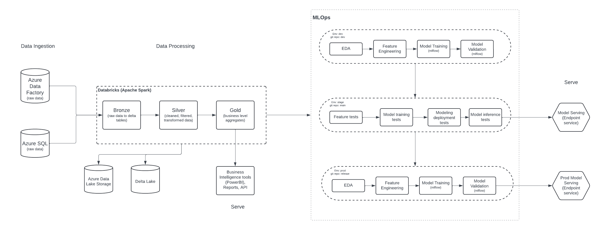
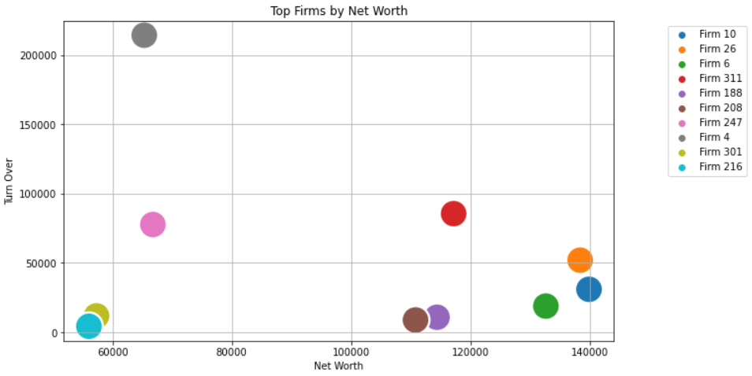
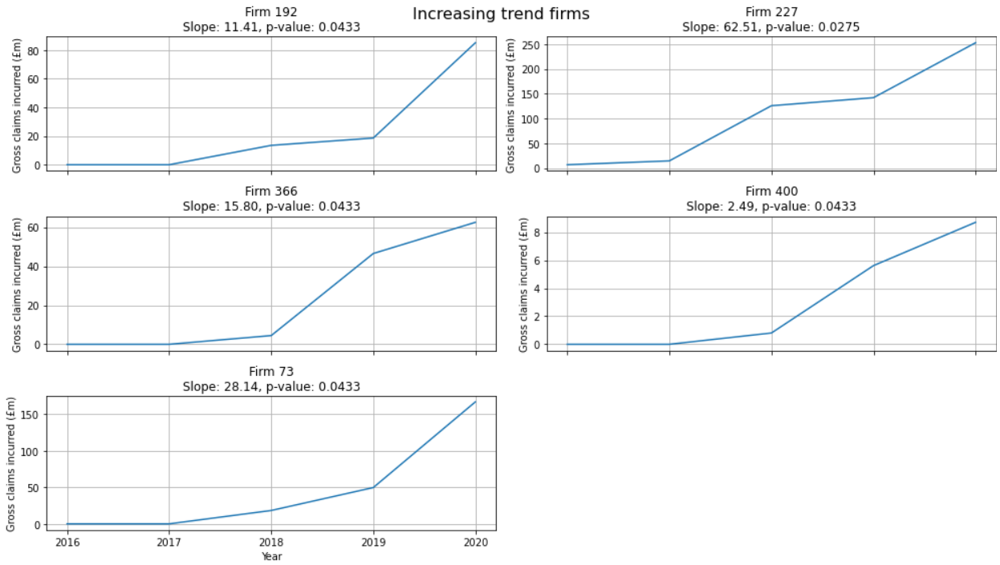
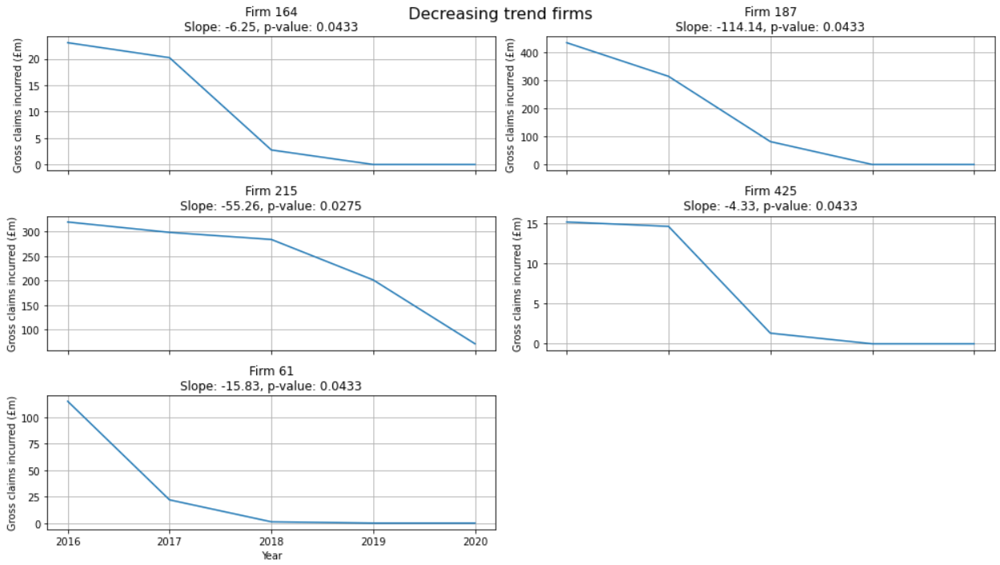
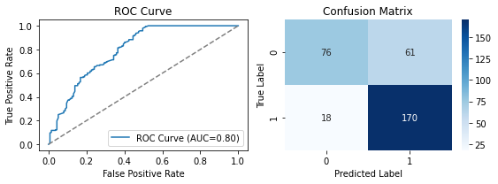

# Firm Analysis
Analyse firms that require most attention 

## Setting up the conda environment

The following steps are need to setup the conda environment.

First step is to create an enviorment with python 3.11 

```
conda create -n test_env python=3.11
```
Then activate the environment
```
conda activate test_env
```

Then install all the dependencies from the requirement file as below.

```
pip install -r requirements.txt
```

## Data Analysis Notebook

```
notebooks/firm_analysis.ipynb
```

## Architecture Proposed

Building a pipeline involving data processing and analytics involves multiple steps from getting the raw data to serving the results. In the architecture proposed we cover a high level process to get data, process it, store it, build reports, build ML models, and finally deploy, and serve the model. I have built the architecture with a combination of Microsoft Azure and Databricks giving high value to scalability and MLOps. 



## Significant Metrics

The below graph shows the top 10 net worth firms with their corresponding turn over the years. 



Monitor the trend in Gross claims incurred using the mann kendall statistical test. Many firms are showing no trend with several firms showing increasing and decreasing trends. This will help in tracking the trend in cost to the insurer.




## Model result 

Boosting is one of the powerful ML algorithms. Hence we try to do hyperparameter tuning for XGBoost to find the best combination of parameters for the model. I use a library called hyperopt. Some important features that are tuned are max_depth, learning_rate, and n_estimators. After 100 iterations of testing various parameter combinations, the best model parameter is generated. The final best model statistics has an accuracy of 76% with the best F1-score in class 1 of 0.81. Following are its other plots.  


